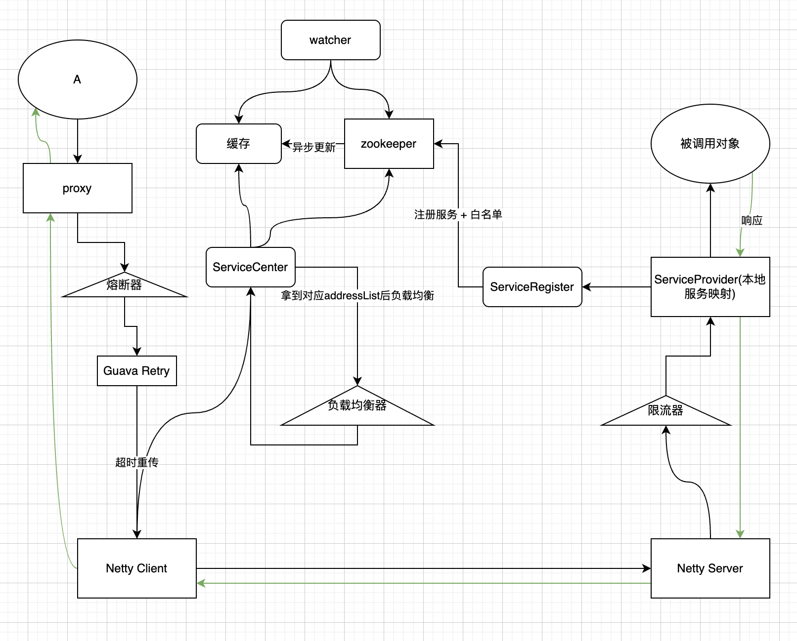

# rpc-framework
## 项目介绍
手写rpc框架

## 项目架构



## 代码结构
```text
- Client
  - cache 本地对注册服务的缓存
  - circuitBreaker 熔断器
  - client 调用netty框架进行通信
  - netty netty配置，序列化方式，处理方式handler
  - proxy 代理类，同时反射调用向server得到接口对象
  - retry 重试机制
  - serviceCenter 注册中心（得到zookeeper中存储的服务）
    - loadBalance 负载均衡
    - ZkWatcher zookeeper监听器，更新缓存
- Server
  - netty netty配置，序列化方式，处理方式handler
  - provider 服务提供者，注册服务到本地
  - ratelimit 限流
  - server 启动netty server服务
  - serviceRegister 注册中心（注册服务到zookeeper）
- Common
  - message 通信消息定义
  - pojo&service 定义操作的对象和接口
  - serializer 序列化方式
```

